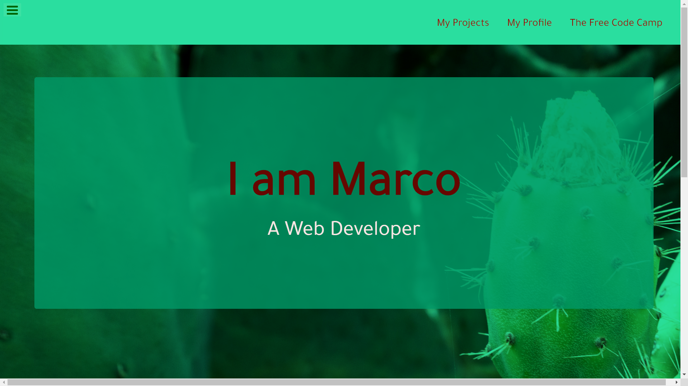
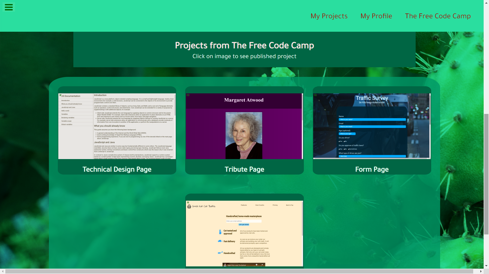
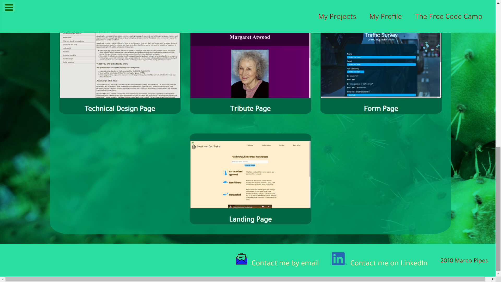

# FCC-portfolio

This portfolio is an exercise for [The Free Code Camp](https://www.freecodecamp.org/). The Code is all mine. I am leaving the testing software on.

This is the opening window of my portfolio, the assignment was to make it take up 100% of the view height. The navbar is fixed.

These are the cards that serve as an illustration of and a link to my Free Code Camp projects:

This is the footer and my contact links:

My Portfolio is [published on Git Hub](https://martucazpo.github.io/FCC-portfolio/) and [as part of my main portfolio](https://martucazpo.github.io/new-portfolio/indexPortfolio.html)
The Picture of the cactus is by Malte Bremer on [Unsplash](https://unsplash.com/)